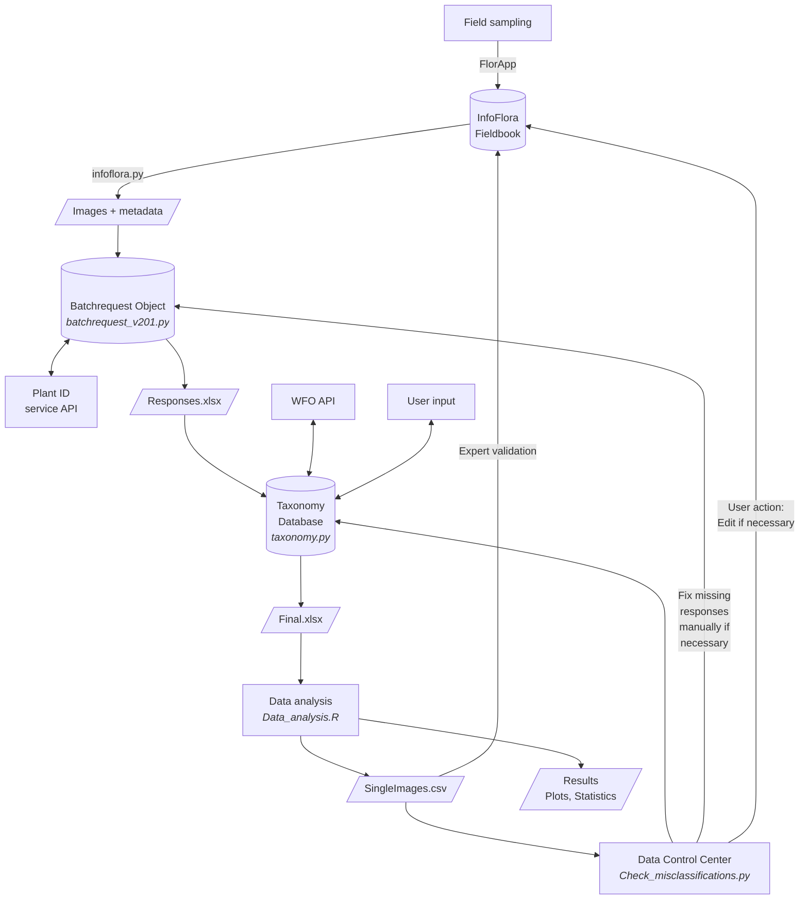

# SwissPlantCV
Testing state-of-the-art vascular plant species identification computer vision models for Swiss vascular plants.

## Dependencies
Script files within this repo are separated by programming language (Python and R) and stage of the project.
Python scripts are stored in subdirectories of [./py3](https://github.com/ManuelPopp/SwissPlantCV/tree/main/py3), whereby each subdirectory accompanies a `requirements.txt` file to facilitate installation of required modules. The parent directory contains such a `requirements.txt` combining all required modules. Note that modules for geospatial analyses are included. These may require correct set-up of [GDAL](https://gdal.org/en/stable/), which cannot be done through a Python package manager like pip. Some modules were only used to facilitate manual data cleaning or to plan fieldwork. It is therefore recommended to only install modules for the required task (i.e., the modules listed in the respective subdirectory).
R scripts were used for analysis of the final data and plotting. The main R script is [./rsc/Data_analysis.R](https://github.com/ManuelPopp/SwissPlantCV/blob/main/rsc/Data_analysis.R), which is set up to install missing requirements automatically.

## Repository organisation
This repository comprises various subdirectories
```r
📂 SwissPlantCV/
├── 📂 bat/
│   └── *.* 'Various files used to run scripts with pre-defined input parameters.'
├── 📂 dat/
│   ├── 📂 BioGeoRegionen/
│   │   ├── 📂 BiogeographischeRegionen/
│   │   │   └── N2020_Revision_BiogeoRegion.* 'Shapefile of biogeographical regions of Switzerland.'
│   │   └── README.txt 'Information on the shapefile within the subdirectory.'
│   ├── GBIF_obs_per_year.csv 'Number of GBIF records per year, obtained via GBIF API.'
│   ├── growth_form_info.csv 'Growth form by species for plants within the data set.'
│   ├── Habitats.xlsx 'TypoCH habitat types, manually compiled following Delarze et al., 2015; see manuscript.'
│   ├── Releve_info.csv 'Information on sampling plots (releves) containing releve ID and location.'
│   ├── Synonyms.db 'Database to translate between taxonomic backbones.'
│   │                'Pickled instance of class SynonymDatabase (py3/analyses/taxonomy.py),'
│   │                'compiled via WFO API and manual resolving.'
│   └── Taxonomic_backbone_wHier_2022.csv 'Taxonomix backbone for Swiss flora.'
├── 📂 out/
│   └── Final.xlsx 'Excel sheet summarising all API responses.'
├── 📂 py3/
│   ├── 📂 analyses/
│   │   ├── Check_misclassifications.py 'Tkinter graphical interface to check wrong IDs manually.'
│   │   ├── locationprecision.py 'Was used to obtain stats on location precision for sampling points.'
│   │   ├── taxonomy.py 'Provides SynonymDatabase class to build taxonomy database.'
│   │   └── requirements.txt 'Python modules used during this step.'
│   ├── 📂 misc/
│   ├── 📂 requests/
│   │   ├── authentication.py 'Load encrypted user credentials for some APIs.'
│   │   ├── base.py 'Basic functions for coordinate conversion, EXIF handling, file encyption, etc.'
│   │   ├── batchrequest_v201.py 'Provides Batchrequest class to send API requests and store responses.'
│   │   ├── <identification provider>.py 'Functions to handle the request formats for the different APIs.'
│   │   └── requirements.txt 'Python modules used during this step.'
│   ├── 📂 sampling/
│   │   ├── <scriptname>.py 'Scripts to facilitate fieldwork, e.g., to visualise sampled habitat types.'
│   │   └── requirements.txt 'Python modules used during this step.'
│   ├── 📂 tk_Search_Releves/
│   │   ├── Releve_species_lists.py 'Tkinter graphical interface to check InfoFlora Fieldbook export for potential sampling locations.'
│   │   └── requirements.txt 'Python modules used during this step.'
│   └── requirements.txt 'All additional Python modules used.'
├── 📂 rsc/
│   ├── Barplot_best_match.R 'Create stacked barplot Figure 3.'
│   ├── Citizen_science_stats.R 'Create barplots of citizen science observations Figure 1.'
│   ├── Completed_habitats_to_table.R 'Create LaTeX table of sampled habitats.'
│   ├── Data_analysis.R 'Main script for data analysis.'
│   ├── Habitat_level_accuracy.R 'Comparison of identification success summarised by habitat type.'
│   ├── Included_taxa.R 'To check on which wrongly IDd taxa the resp. model was not trained.'
│   ├── Observation_level_accuracy.R 'Comparison of identification success summarised by observation.'
│   ├── Sampling_design.R 'Create map from initial submission, etc.'
│   ├── Tables_acc_per_plant_part.R 'Create LaTeX table of ID success per plant part'
│   ├── Taxon_in_<ID provider>.R 'Check if specific taxon known to model. Where no API -> manual check.'
│   ├── taxonomy_match_manual.R 'List of synonyms that were manually resolved.'
│   └── wfo.R 'Check synonyms using WFO.'
└── README.md 'This file.'

```

## Workflow
Data validation and analysis is conducted as an iterative process with several loops (Figure 1). The main reason for this are the need to manually check taxonomic mismatches, as well as the possibility of false species identifications in the InfoFlora Fieldbook.
Plant photographs are taken in the field. They are annotated and uploaded to the InfoFlora Fieldbook via the FlorApp. The script infoflora.py is then used to download all labelled images via the InfoFlora API and store them locally with corresponding metadata. Subsequently, one or multiple Batchrequest objects are created. These point to the images and hold information about image location and metadata. The Batchrequests objects set up a connection to the identification providers via the respective APIs, send identification requests for each image, and store the response. Top taxon suggestions are then extracted in a standardised format and written to Responses.xlsx.

In the next step, the taxonomy.py is used to standardise the taxonomy bewteen different plant identification providers. To avoid having to store a data base of the entire world's plant taxonomic systems, the script only checks taxa that occur in the Responses.xlsx. If a name suggested by an identification provider does not match the name from the InfoFLora Fieldbook, the script sends an API request to WorlfFloraOnline (WFO) to check if the name is listed as a synonym. If the taxonomy cannot be resolved automatically, the user is asked to resolve the issue manually. We compared the taxon suggestion of the identification providers considering the respective taxonomic backbone and concepts of e.g. aggregates and used further taxonomic databases such as that of Kew Botanical Gardens. The script then creates Final.xlsx, which is used by Data_analysis.R. During data analysis, false identifications are flagged and exported to SingleImages.csv. This file is used by Check_misclassifications.py, which provides a GUI to explore the wrong identifications and search for obvious issus, e.g., photographs that were accidentially uploaded with the false observation. (I.e., errors from data entry in the field or any remaining unresolved taxonomy mismatches.)

After such technical issues are resolved, SingleImages.csv was used to identify observations where additional expert validation was required. After resolving remaining issues, image metadata is updated within the Batchrequest object(s). Data_analysis.R then produces the final version of plots, statistics, and LaTeX tables.


**Figure 1:** Overview of the data collection and processing workflow. Additional steps involved manual insertion of Flora Incognita and FlorID "vision only" results into the Batchrequest objects, resp. the Responses.xlsx via additional scripts. This is due to the circumstance that Flora Incognita did not provide direct access to their API but ran the model locally and sent us the results as json. For the vision only version of FlorID, the information was separately extracted from the responses (already present in the Batchrequest objects, but not stored separately from the combined model output).

## Prerequisites
### General
Script files within this repository cannot be executed as standalone scripts. They require the surrounding file structure, including other scripts, data, and tables for functioning.

### Data
Derived data are stored along with code in this repository. This includes tables used in data analyses, as well as some intermetiate files exported from within Python scripts (pickled versions of attributes for some instances of custom classes which hold methods to load such files and, in doing so, restore a previous state).

Image data, however, are stored in an accompanying data repository and must be downloaded separately.

**Metadata:** The data repository contains metadata files. These files hold information on all images, as well as on the location where they were stored.

### Python scripts
#### General
Python scripts require installation of additional modules. Directories where Python scripts are located contain a `requirements.txt` file. Such a file can be used to install modules using Python's default package manager [pip](https://pypi.org/project/pip/). Requirements can be installed by simply running

```console
pip install -r requirements.txt

```

Note that `requirements.txt` files within this repository specify a module version to make code exactly reproducible. Due to the open source nature of the software used, modules might be discontinued, functions or function parameters might be deprecated, and code might become incompatible with some future version of a module or a future version of Python. However, code published within this repository is compatible across a range of Python versions. Thus, it is likely possible to run code without installing a specific Python version, or a specific version of a module. Feel free to remove the version pinning in your local copy of this repository.

Code has been tested with several Python versions 3.9.x, 3.11.x and 3.12.5. Important note: Geospatial analyses require proper setup of Python with GDAL bindings. Python was therefore installed using the [OSGeo4W](https://www.osgeo.org/projects/osgeo4w) installer. Note that all relevant parts (e.g. pip) of Python must be installed and set up correctly.

#### Python packages
Here is a list of the required Python modules. For further information, see the section above and the `requirements.txt` files within each Python script (sub)directory.

- geopandas
- fiona
- simplekml
- numpy
- pykew
- exif
- opencv-python
- pandas
- pyproj
- requests_oauthlib
- easygui
- shapely
- qgis
- requests
- Pillow
- piexif
- cryptography
- oauthlib
- pyinaturalist
- tkinter
- wget
- alive_progress

### R scripts
#### General
The main R script is [Data_analysis.R](https://github.com/ManuelPopp/SwissPlantCV/blob/main/rsc/Data_analysis.R). It should automatically try to install all required packages. The script requires supplementing R scripts at the exact relative position as within this repo, since some sub-workflows were separated to enhance readability and limit the size of the main script. Moreover, the script reads in tables. If the R script is not called from within the common [RStudio](https://www.rstudio.org) IDE, make sure to search for where the ```dir_main```r variable is defined (```dir_main <-```r) and set the value of this variable manually to the main directory of your local copy of this repo.

Code has been tested with R versions 4.4.0 and 4.4.1., as well as some older versions > 4.3.x.

#### R packages
Scripts used during our analyses normally install all required packages automatically. The following list is an overview of the required packages.

- afex
- dplyr
- emmeans
- ggbreak
- ggplot2
- grDevices
- grid
- gridExtra
- lme4
- MASS
- multcomp
- parallel
- pbkrtest
- readxl
- reshape2
- rjson
- rstudioapi
- stringr
- terra
- tidyr
- treemap

### Obtaining image data
API requests to the Info Flora Online Fieldbook are not necessary, since the full data set has already been compiled and made available in the data repository. Moreover, the fieldbook is only available to project members and curators. All code related to obtaining curated image data from the web is only for documentation purpose.

## Disclaimer
This repository contains code to send API requests to third-party plant species identification providers. These APIs **are not part of this project**, and, unless officially stated by a relevant authority, the owner of this repository and potential past, active, or fututure contributors **have no affiliation** with these third-party providers.

Users should be aware that:

- API requests to plant identification services **typically require authentication**. Users are responsible for obtaining any necessary login credentials from the respective providers.
- **The terms, conditions, and policies** governing the use of these APIs are set solely by their respective owners. We (the owner and potential contributers of this repository) **do not control, endorse, or guarantee** the availability, reliability, or accuracy of these services.
- The respective owners of the APIs may, at any time, with or without notice, make changes to their APIs in a way that changes the behaviour or output of their API, or that affects compatibility with code within this repository. They may also restrict access to, or entirely remove their APIs at any time. We do not guarantee future compatibility of the code within this repository with any of the APIs.
- **We accept no liability** for any actions users take when interacting with these APIs, including but not limited to violations of third-party terms of service, rate limits, or misuse of the data retrieved.

Users are advised to carefully review and comply with the respective API providers' policies before use.

## Further information
For more information, see also the [Wiki](https://github.com/ManuelPopp/SwissPlantCV/wiki) of this repository.