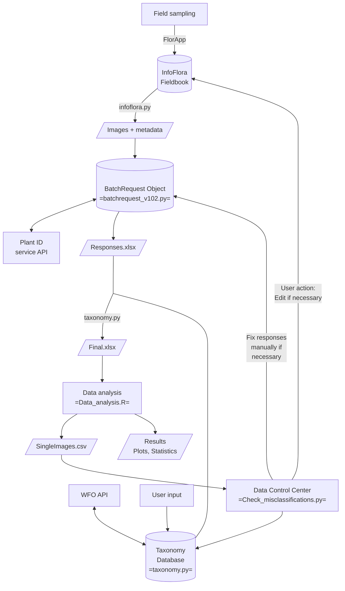

# SwissPlantCV
Testing state-of-the-art vascular plant species identification computer vision models for Swiss vascular plants.

## Workflow

```mermaid
graph TD
    A[Field sampling] --> |FlorApp| B[(InfoFlora\nFieldbook)]
    B --> |infoflora.py| C[/Images + metadata/]
    D[(\nBatchRequest Object\n=batchrequest_v102.py=)] <--> E[Plant ID\nservice API]
    C --> D
    D --> F[/Responses.xlsx/]
    F --- G[ ]:::empty
    G --> |"taxonomy.py"| H[/Final.xlsx/]
    I[WFO API] <--> J[(Taxonomy\nDatabase\n=taxonomy.py=)]
    K[User input] --> J
    J --- G
    H --> X[Data analysis\n=Data_analysis.R=]
    X --> L[/SingleImages.csv/]
    L --> M[Data Control Center\n=Check_misclassifications.py=]
    M --> J
    M --> |Fix responses\nmanually if\nnecessary| D
    M --> |User action:\nEdit if necessary| B
    X --> Z[/Results\nPlots, Statistics/]
classDef empty width:0px,height:0px;
```
